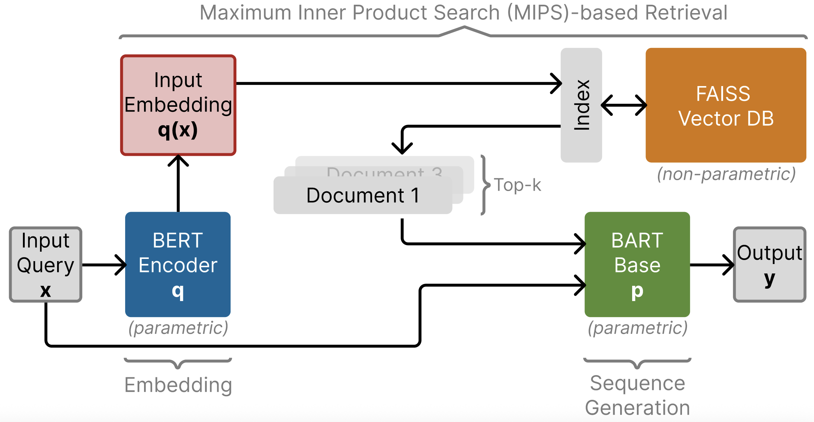

# Retrieval-Augmented Generation (RAG-Sequence Mode)



## Introduction

This GitHub repository is our reimplementation of the original Retrieval-Augmented Generation (RAG) paper: *Retrieval-Augmented Generation for Knowledge-Intensive NLP Tasks* (Lewis et al., 2021).

Large Language Models (LLMs) are highly effective across many natural language processing tasks but often struggle with factual recall due to limitations in fixed context windows and static parameter knowledge. RAG addresses these limitations by integrating parametric knowledge (from LLMs) with non-parametric memory through document retrieval.

## Chosen Result

We chose to fine-tune the RAG-Sequence model using Fast Decoding on the rag-mini-bioasq and FEVER datasets. The primary goal was to reproduce the significant performance improvements of RAG over baseline models (such as BART) demonstrated in the original paper. Specifically, we aimed to show enhanced BLEU/ROUGE scores in abstractive Question Answering (QA) and increased accuracy in Fact Verification tasks.

## GitHub Contents
- **Code**: Implementation, training loops, and evaluation pipelines.
  - **Code/generator**: Contains the generator module leveraging `BartForConditionalGeneration`.
  - **Code/retriever**: Includes the retriever module, comprising a BERT-based encoder and retrieval logic using FAISS.

## Re-implementation Details
- **Retriever**:
  - Utilized Dense Passage Retrieval (DPR) with BERT-based encoders.
  - Stored document embeddings in a FAISS vector database, enabling efficient retrieval via Maximum Inner Product Search (MIPS).

- **Generator**:
  - Used BART-base (approx. 140M parameters).
  - Implemented Fast Decoding to efficiently select the final generated output from multiple candidate sequences.

- **Training**:
  - Fine-tuned BERT query encoder and BART generator on the rag-mini-bioasq dataset.
  - Conducted fine-tuning for 5 epochs with varying retrieval top-k values (3, 5, 10).
  - Evaluated models using BLEU-1 and ROUGE-L for QA tasks, and accuracy, precision, recall, and F1 scores for Fact Verification.

## Reproduction Steps

### Environment Setup
1. Create a new conda environment:
```bash
conda create -n rag python=3.8
conda activate rag
```

2. Install required packages:
```bash
pip install torch transformers datasets faiss-cpu tqdm numpy
```

### OpenQA (rag-mini-bioasq) Training
1. Download the dataset:
```bash
python -c "from datasets import load_dataset; load_dataset('rag-datasets/rag-mini-bioasq')"
```

2. Train the model:
```bash
python src/Training/train.py \
    --dataset rag-mini-bioasq \
    --model_name facebook/bart-base \
    --batch_size 8 \
    --epochs 5 \
    --learning_rate 5e-5 \
    --top_k 3 \
    --output_dir checkpoints/openqa
```

3. Evaluate the model:
```bash
python src/Training/evaluate.py \
    --checkpoint checkpoints/openqa/model.pt \
    --dataset rag-mini-bioasq \
    --split test \
    --top_k 3
```

### FEVER Training
1. Download the FEVER dataset and create embeddings:
```bash
# Download FEVER dataset
python -c "from datasets import load_dataset; load_dataset('fever', 'v1.0')"

# Create FAISS index for FEVER pages
python src/Training/create_fever_index.py
```

2. Train the model:
```bash
python src/Training/train_fever_rag.py \
    --batch_size 8 \
    --epochs 2 \
    --learning_rate 5e-5 \
    --top_k 1
```

3. Evaluate the model:
```bash
python src/Training/evaluate_fever.py \
    --checkpoint checkpoints/fever_rag.pt \
    --split test
```

Note: Training times may vary depending on your hardware. A GPU with at least 16-32GB VRAM is recommended.

## Results / Insights

### Abstractive Question Answering (rag-mini-bioasq)
| Method | k | Avg BLEU-1 | Avg ROUGE-L |
|--------|---|------------|-------------|
| Baseline (BART) | - | 0.1086 | 0.2225 |
| RAG-Sequence | 1 | **0.4355** | 0.3860 |
| RAG-Sequence | 3 | 0.4260 | 0.3863 |
| RAG-Sequence | 5 | 0.4340 | **0.3865** |
| RAG-Sequence | 10 | 0.4355 | 0.3860 |

We observed nearly a 4x increase in BLEU-1 and a 1.5x increase in ROUGE-L compared to the baseline.

### Fact Verification (FEVER)
| Approach | Accuracy | Macro-Precision | Macro-Recall | Macro-F1 |
|----------|----------|-----------------|--------------|----------|
| Baseline | 0.2380   | 0.0793          | 0.3333       | 0.1282   |
| RAG      | **0.6562** | **0.6626**       | **0.6354**    | **0.6372** |

RAG significantly improved the accuracy and F1-score on the FEVER dataset, demonstrating its effectiveness in fact verification tasks.

## Conclusion

Consistent with the original paper, our reimplementation confirmed that RAG substantially improves performance on knowledge-intensive tasks like abstractive QA and fact verification. We notably observed that RAG performs exceptionally well on niche datasets involving specialized terminology.

Additionally, we found modularity crucial for debugging and effective collaboration. Insights were gained regarding optimization and loss computation for RAG's multi-document processing.

Future exploration may include testing with larger models/datasets, semantic evaluations, cost-effective fine-tuning of document encoders, and potential multimodal extensions.

## Links
### Paper 
[arXiv Paper](https://arxiv.org/pdf/2005.11401)

### Dataset
- [rag-mini-bioasq](https://huggingface.co/datasets/rag-datasets/rag-mini-bioasq)
- [FEVER](https://fever.ai/)

### Poster
[Poster PDF](poster/poster.pdf)

### Report
[Report PDF](report/DL___Final_Report.pdf)

## Disclaimer

Large Language Models have beem employed in the work on this project for general refactoring and debugging of code components, as well as editorial/grammar-related work for the written parts.

## References
- Lewis et al., 2021. "[Retrieval-Augmented Generation for Knowledge-Intensive NLP Tasks](https://arxiv.org/pdf/2005.11401)," NeurIPS 2020.
- [rag-mini-bioasq dataset](https://huggingface.co/datasets/rag-datasets/rag-mini-bioasq)
- [FEVER dataset](https://huggingface.co/datasets/fever/fever/tree/main)

## Acknowledgements

We acknowledge and are thankful to the instructors of the course CS4782: Introduction to Deep Learning course at Cornell for providing us with the opportunity to reproduce the results of this interesting paper. The course outline drove us to create good final results and included a fun poster presentation, which gave us valuable insight into the field of academic project work.
